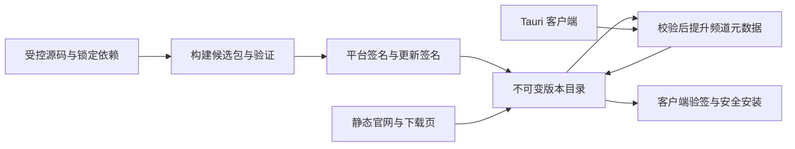

# 官网分发与安全更新方案

**Linux x64 首发准备：** 无 GUI 执行节点使用独立 tar.gz、SHA256SUMS 和 `releases/linux/latest.json`；本次只发行 x64，ARM64 暂不发布。公开记录要求 x64，ARM64 为可选项，平台与 artifact 来源必须完全对应，校验文件只列实际发行的平台。使用只读 `linux-ci.yml` 完成原生构建与验收，再手动触发 `linux-release.yml`，提供同一 main 提交已经成功结束的构建 run ID 与 x64 artifact ID。流程复核来源、解包启动/停止、身份保持、认证边界及摘要后才创建独立 Linux Release，并在公开完整下载核对成功后推进 Linux 记录。未通过的架构不得写成可用。

只发行 Linux 时以 `[skip ci]` 提交避免现有 main Windows 自动发行，随后手动执行 Linux 两阶段流程。不可变路径为 `releases/linux/linux-v<version>-<commit12>-<buildRunID>/`；手动 Linux 流程不触发 Windows 发行，也不更改 Windows latest/updater。Linux 当前为手动停止节点、更换程序、保留数据目录的升级方式，校验和不等于数字签名。流程源码及 Hook 返回成功不等于正式发行收尾完成；官网实际部署、公开完整下载和 [R2 保留检查](R2-RETENTION.md) 仍须核对并如实记录。使用说明见 [Linux CLI](LINUX.md)。

**2026-09-18 · 0.1.18 正式发布与收尾完成。** 托盘关闭/直接退出、步骤等待和队列诊断、Windows 局域网检测及定向修复已发行。源码 1aa920d14ad9382b4c339334db0a470b1914d9f9，发行 v0.1.18-1aa920d14ad9-10534808566；[构建与发布](https://github.com/rivloom/rivloom-desktop/actions/runs/35313869617)。同提交三份 CI、原生测试、NSIS 构建、隔离安装/启动/重启/卸载及原公钥签名核验通过。匿名完整下载 89318474 字节，SHA256 fc84ec9672dd5d1507aa816c714e5685ea50955ea0b48f1cc0e60dade5bd2c9d。官网中英文指南、更新日志、连接 FAQ 和下载页已实际部署并复核，Actions 继续停用。R2 保留 50、暂缓 0、删除 0；检查完成，删除 0 个，见[本次审计](releases/0.1.18-r2-retention.md)。

**2026-09-18 · 0.1.18 发行准备中。** 按用户本轮推送意图，整理当前已验收的 desktop 改动并沿用 main 自动发行链。包含托盘关闭/直接退出、步骤等待与队列诊断、Windows 局域网检测和定向修复；官方 OpenCode 1.18.25 / Node 24.19.0 不变。此前实机验收及遗留边界保留，不要求重做已通过的基础远程任务。版本已递增，当前尚未提交或推送；云端同提交 CI、隔离安装、公开下载、签名更新、官网部署与 R2 保留检查须按实际结果收尾。

**2026-09-16 · 0.1.17 正式发布与收尾完成。** 同厂商多账号别名、独立 API Key / OAuth、可折叠模型分组、接入确认简化及系统字体清晰度调整已发行。源码 `4898aac55d8521048a6b4770211e622b1381d6be`，发行 `v0.1.17-4898aac55d85-10440794423`；[构建与发布](https://github.com/rivloom/rivloom-desktop/actions/runs/35083323560)。同提交三份 CI、原生测试、NSIS 构建、隔离安装/启动/重启/卸载及原公钥签名更新核验通过。匿名完整下载 89186012 字节，SHA256 `c1667afe09d1de5e8c0b7110611f61dac80a5808a18f095da2c6d090d4fa3b14`。官网配套中英文说明和当前 UI 截图已由 Pages 实际部署，页面、图片、下载回读与浏览器布局通过；官网 Actions 继续停用。R2 保留 47、暂缓 0、删除 0；检查完成，删除 0 个，见[本次审计](releases/0.1.17-r2-retention.md)。历史准备状态不覆盖本段。

**2026-09-16 发布结果：** 0.1.16 源码 `3b12dbad75b45bdab23f251d5bc6ac6a601898cf` 已通过同提交 CI、原生测试、NSIS 构建、隔离安装和完整公开下载/原公钥签名核验。[构建与发布](https://github.com/rivloom/rivloom-desktop/actions/runs/35064624969)；官网配套已实际部署。R2 保留 44、暂缓 0、删除 0，见 [本次审计](releases/0.1.16-r2-retention.md)。下面旧版本与准备状态保留为历史。

**2026-09-15：** 0.1.15 已完成发行、官网部署、原公钥验签及 R2 保留检查，删除 0 个。安装器源码为 97ab793；后续文档提交不改变已发布包。手动 inventory 只列举对象，不执行自动清理，详情见维护者本地验证记录。

**2026-09-14：** 0.1.14 发布与官网部署已完成，原密钥签名核验及 R2 保留审计通过，删除 0 个。手动 inventory 只列举对象，不执行清理。具体证据见维护者本地验证记录。

**2026-09-11 当前发布约定：** 0.1.13 已完成正式发布、签名更新和官网部署。每次后续发行必须按 [R2 发行文件保留与清理](R2-RETENTION.md) 收尾：最近 3 个正式版本、近 30 天发布的包及当前引用均受保护，仅清理同时不满足保留条件的已确认旧包。禁止对整个桶简单设置到期删除。自动清理尚未接入，检查及执行结果必须由发布执行者记录；下面旧版本的未上线描述是历史状态。

更新日期：2026-09-09。状态：**0.1.5 已实现应用内更新及独立签名频道发布代码，本地验证通过；本轮未安装、发布或配置远端签名密钥。既有普通 Release、R2 公开文件与官网刷新链路保留。** 当前实现、首次接入与上线步骤见 [应用内更新](DESKTOP-UPDATES.md)。 本文依据用户提供的《官网分发与更新方案》讨论，结合实际实现维护；本轮去 Preview 的用户决定取代此前仅发布独立预览的命名安排，不改写历史验证结果。

M2 负责 Windows 安装与客户端更新，M5 负责官网与分发。main 上已验收候选通过 `ci-release.ts` 自动发布普通 Release；公开文件同步采用新的严格 desktop 下载记录，配置和重试规则见 [CI](CI.md#同步-rivloom-到官网公开下载)。R2 桶与下载域已活动，新增持续访问密钥和 Pages Hook 仍待此前授权，本次不创建凭据。新版云端、安装和发布结果须按实际源码另行核对；M3.5 用户与双物理机验收、签名和升级矩阵仍分别推进。历史事实见维护者本地验证记录。

## 1. 从对话中保留与修正的内容

| 对话观点 | 处理 | Rivloom 的落地解释 |
| --- | --- | --- |
| 官网与安装包分开，使用静态站、对象存储/CDN | 保留 | 官网负责介绍与下载入口，版本文件独立保存；可以共用服务商，逻辑职责不混在本地业务服务里 |
| 自动更新先使用静态元数据，无需一开始建设后台 | 保留并补充 | 采用官方 Tauri updater；还需签名、升级生命周期、数据迁移与故障恢复，不能只做版本比较和下载 |
| 自有域名屏蔽存储供应商变化 | 保留 | 域名是受控的长期入口；迁移仍需核验 TLS、缓存、路径、公钥信任与旧客户端，不能保证天然无感 |
| Electron / Tauri、多平台同时发布 | 收敛 | 仓库已使用 Tauri 2，首期只发布经验证的 Windows x64 NSIS；不再选壳，macOS、Linux、ARM64 单独评估 |
| 元数据中有 URL 和 SHA-256 即可更新 | 修正 | 原例是通用示意，不是 Tauri 契约；Tauri 更新文件必须提供其 updater 签名，哈希不能代替签名 |
| Git Tag 触发构建、签名、上传与发布 | 保留并分阶段 | CI 自动生成候选产物与证据，通过目标版本发布检查后才提升频道；推送 tag 不直接等于正式发布 |
| stable / beta / nightly、灰度和动态 API | 分期 | 首期保留 stable 与显式选择的 beta；nightly、分批灰度、企业策略和动态 API 按实际需求再做 |
| 坏版本不可覆盖，应发更高版本修复 | 保留并补充 | 停止继续投放坏版本，已安装用户走更高版本修复；数据格式不兼容时不承诺直接降级或自动回滚 |
| 区分应用版本与节点协议版本 | 保留并纠正现状 | 仓库已有协议版本和 capability；补充兼容矩阵与数据格式迁移，不从零另造一套协议 |
| 全球源与中国大陆镜像 | 条件保留 | 依据目标用户实际下载/更新测量选源；未测前不承诺任何供应商在目标地区的可用性或速度 |

对话中的价格、免费额度和示例域名不作为成本预算或资产归属事实。部署前核对实际域名控制权、目标地区、存储/请求成本及签名条件；未开放的平台不展示可点击的下载按钮。

## 2. 当前仓库基线

- 当前源码正式应用版本为 `0.1.5`，名称 Rivloom，identifier 为 `com.rivloom.desktop`。当前 NSIS 为 currentUser 安装，缺失 WebView2 时使用联网 bootstrapper。
- `tauri.preview.conf.json` 继续供开发验证使用，其独立身份为 `com.rivloom.conversationpreview`；普通发行不加载它。旧 Preview 的安装和数据保留，不自动迁移为正式身份。既有正式 0.1.3 的覆盖升级仍需独立验收，不能用 Preview 改名或全新安装检查代替。
- 已接入官方 updater、内置公钥及 `updates/stable/latest.json`。候选仍关闭 updater artifacts，安装验收通过后 publish 创建普通 Release，website-download 验证公开文件，再由独立 updater job 对同一安装器签名并提升更新频道；未启用该 job 时仍只有手动下载。website-download 由明确的启用变量控制，当前已启用并完成首轮真实同步。两个源码仓库保持私有，GitHub 下载仍需仓库访问权限；官网 R2 入口提供匿名下载。
- `server/node-identity.ts` 已定义 `nodeProtocolVersion = 1`；`server/node-network.ts` 使用协议版本校验与 `remote-execution-v1`、`brain-task-v1`、队列回执等 capability。已有机制应延续，不能随意放宽握手或向旧严格消息结构添加字段。
- 本地持久状态包含 SQLite 和多类 JSON；`server/store.ts` 当前设置 `PRAGMA user_version=3`，新增读前拒绝未来格式守卫；仍不是完整的有序迁移或自动恢复机制。
- 客户端管理本地业务服务、Node 和官方 OpenCode 子进程。Task/Execution、Node 身份、信任与 Brain 归属必须跨升级保持；当前固定 Master Host 无自动接管，关闭客户端会影响执行与调度。

官网已通过 Cloudflare Pages 上线，本轮去掉对外 Preview。桌面各层检查及边界见 [CI](CI.md)、[runtime 校验](CI-RUNTIME.md) 与[签名发行契约](releases/README.md)。历史官网与 R2 结果不替代本版公网更新和真实安装验收。

## 3. 最小分发架构

下面是签名发行与客户端安全更新的目标架构；当前未签名普通 Rivloom 发行另见本节后半部分。



官网提供产品说明、下载、指南、更新、安全、隐私和支持页面。下载卡片统一使用 Rivloom 名称；只展示经过对应流程确认的记录，并明确未签名和手动更新。新公开记录与现有 stable/beta 签名契约分开校验，不通过改名降低签名断言要求；0.1.4 的首次匿名完整下载已通过字节核验。

官网已采用 Astro 静态站，用户已确认 `rivloom.com` 与 Cloudflare 同时服务中国大陆及海外，暂不增加国内专用 CDN。Pages 仅连接官网仓库；生产部署与域名验证已完成，官网视觉更新也已上线。专属 R2 桶为 `rivloom-downloads`，下载自定义域 `downloads.rivloom.com` 活动且最低 TLS 为 1.2；2026-09-06 已配置 Actions 凭据与 Pages main Hook，完成首轮公开文件及正式下载页核验。首版不包含账户数据库或 License 服务。

源码可以继续保密。若用 GitHub Releases 面向公众下载，应使用明确公开的分发仓库，或由受控 CI 将私有仓库产物上传到公开下载存储；不能把私有仓库访问 token 塞进客户端、静态网页或公开元数据。

采用用户控制的 HTTPS 入口。以下域名均为**占位示例，不代表已有官网或域名已注册**：

```text
https://www.example.com/download
https://releases.example.com/stable/latest.json
https://releases.example.com/stable/0.2.0/Rivloom_0.2.0_x64-setup.exe
https://releases.example.com/stable/0.2.0/Rivloom_0.2.0_x64-setup.exe.sig
https://releases.example.com/beta/latest.json
```

版本目录只写一次，同一版本/平台的发布字节不得替换。版本包可长时间缓存；`latest.json` 等频道指针须使用短缓存或强制重新验证。对象存储默认策略不等于所需 CDN 策略，需分别配置并实测。R2 正式服务使用自定义域名，不以面向开发的 `r2.dev` 地址作为长期生产入口。依据：[R2 公共存储桶文档](https://developers.cloudflare.com/r2/buckets/public-buckets/)。

首期只选一个主要下载源并测通。出现明确地域可用性问题后再增加镜像；各源必须分发同一版本的完全相同字节和签名。静态站故障不应影响已安装客户端的本地工作；更新源故障不应阻塞应用启动。

### 普通 Rivloom 发行的公开同步

链路为：同一源码三组 CI 通过 → desktop 候选构建与安装验收 → 私有仓库普通 GitHub Release → 已启用的 website-download 核对原候选与实际 Release → 上传 R2 不可变文件 → 匿名完整校验两份文件 → 条件更新并核对公开 latest → Pages main Hook。安装器始终使用通过验收的原字节，网站 Git 和 dist 不存安装器或内部报告。发布器保留 make_latest:false，不额外竞争 GitHub Latest。

公开安装包和 SHA256SUMS.txt 位于 `https://downloads.rivloom.com/releases/<完整标签>/`，同名对象只可复用相同字节。固定记录为 `https://downloads.rivloom.com/releases/latest.json`，kind 为 rivloom-download，绑定 desktop/com.rivloom.desktop、普通 Release 和两份文件的 URL/大小/摘要/验收状态。普通版本不能带预发布后缀；旧 Preview 记录、安装身份与 previews 路径被拒绝。该 JSON 供官网选择下载，不是客户端更新清单。

latest 的推进同时受全局同步并发组、源码祖先关系和条件写入（CAS）约束：跨源码只提升到当前源码的后代；同源码只允许更大的 artifact ID，相同 artifact 必须绑定一致才可复用。更新使用刚读取的 ETag，初次创建要求对象不存在；竞争冲突后重新读取与判断，不能盲目覆盖。旧构建或分叉构建不推进指针、不触发官网。版本文件使用 immutable 长缓存，latest 使用 `no-store`，公开读取成功后才触发构建。

R2 请求显式发送并签名 `Accept-Encoding: identity`，以保留用于条件写入的强 ETag；弱 ETag 仍拒绝，不剥离 `W/`。该修复已在 `84dfc09` 的实际新发行中完成条件更新和官网 Hook 验证，见维护者本地验证记录。

R2 凭据仅限专属桶对象读写，Pages Hook 绑定官网 main；秘密只存桌面 Actions，见 [配置表](CI.md#同步-rivloom-到官网公开下载)。`RIVLOOM_PUBLIC_DOWNLOADS_ENABLED` 与官网源码 `publicDownloadsEnabled` 已在获得授权及真实文件校验后启用。生产 404、超时、重定向或校验失败均保留原成功部署。新快照独立于旧 Preview，不能按干净 checkout 猜线上没有发行。

上传或公开文件核验失败时 latest 保持原值。指针已更新而公开 latest 核验或 Hook 失败时，保留阶段报告，重跑同一同步复用已核对文件并重新触发，不自动回退指针。Hook 成功不是页面上线证明；每次交付须分别核对 `website-download` 的 `result.json`、实际 Pages 构建、公开记录、完整安装包/校验文件以及线上下载卡片的一致性。首轮 0.1.4 的实际结果见维护者本地验证记录。

## 4. 更新清单、签名与频道

0.1.5 已使用 [Tauri 2 官方 Updater](https://v2.tauri.app/plugin/updater/) 并锁定插件 2.11.0；固定 HTTPS endpoint 与内置公钥，独立发布 job 对经过安装验收的同一 NSIS 字节签名，候选阶段不提前生成 updater artifacts。下方旧示例保留为契约说明，实际额外签名的清单以 [应用内更新](DESKTOP-UPDATES.md) 和 `scripts/updater-manifest.ts` 为准。使用构建工具生成的实际文件与签名，不手工猜测产物名或从其他平台复制元数据。

静态清单应遵循官方字段，示意如下；示例签名和版本不是可发布产物：

```json
{
  "version": "0.2.0",
  "notes": "本版本的变化、兼容范围和已知限制。",
  "pub_date": "2026-09-05T00:00:00Z",
  "platforms": {
    "windows-x86_64": {
      "signature": "<构建生成的 .sig 文件内容，不是文件 URL>",
      "url": "https://releases.example.com/stable/0.2.0/Rivloom_0.2.0_x64-setup.exe"
    }
  }
}
```

这里使用 `windows-x86_64`、`pub_date` 和 `signature`，不沿用原对话的 `windows-x64`、`releaseDate`、仅 `sha256` 示例。发布流程负责验证所有平台条目完整，客户端负责校验目标平台与版本；不得让占位签名进入正式清单。

三种校验分别管理：

| 机制 | 用途 | 边界 |
| --- | --- | --- |
| SHA-256 | 下载页人工核对、镜像字节比对、发布证据追踪 | 被攻击者同时替换文件与哈希时不能证明发布者身份 |
| Tauri updater 签名 | 客户端以预置公钥验证更新文件来源与完整性 | 不能关闭验证；不是 Windows 发布者证书，也不自动证明频道元数据新鲜 |
| Windows Authenticode 与时间戳 | 系统验证产品 EXE/安装器的发布者及签名完整性 | 与 updater 密钥分开；签名不保证新文件立即获得 SmartScreen 信誉或完全无提示 |

Authenticode 完成后再对最终 updater 产物签名并计算哈希，任何会改变文件字节的步骤都必须在最终校验之前结束。上游 Node/OpenCode 保留官方原始文件和既有来源校验。updater 公钥可随客户端分发；其私钥、平台签名凭据和存储写凭据不得进入源码、安装包或报告。

签名密钥应有受控备份、最小授权与恢复方案。CI 使用受保护的发布环境，构建测试与签名权限分开，外部 PR 不接触密钥。公钥轮换需要旧客户端可验证的过渡版本或受控重新安装路径，不能只换服务器私钥后假定所有已安装客户端仍能更新。Windows 签名集成依据：[Tauri Windows 代码签名](https://v2.tauri.app/distribute/sign/windows/)；系统提示以 [Microsoft SmartScreen 信誉说明](https://learn.microsoft.com/en-us/windows/apps/package-and-deploy/smartscreen-reputation)为准。两份资料对 EV 证书能否立即避免提示存在差异，不采用 Tauri 页面的免提示表述。

首期正式产品默认 stable；beta 需用户主动选择并清楚显示频道。独立 UI Preview 保持自身 identifier、数据根和发布入口；构建/发布校验同时核对身份、平台与频道，禁止仅凭相同版本号把预览包挂到正式清单。

版本比较遵循 SemVer，禁止字符串大小比较。静态 JSON 本身不提供按用户分批灰度或强制升级策略；先通过内部分发和 beta 验证再提升 stable。beta → stable 如果需要降低版本，先等待更高 stable 或走另行验证的迁移流程，不默认启用降级。nightly、动态更新 API、灰度分组和组织策略留待实际需求；不把 Electron 的灰度字段直接移植为 Tauri 能力。

## 5. 客户端安全升级流程（待实现）

初版采用“检查更新 → 查看说明 → 下载 → 稍后安装 / 安全退出后安装”。后台检查可在启动后执行并设置超时、退避和频率上限；用户始终有手动检查入口。断网、404、缓存旧清单或下载失败应给出可重试状态，保持当前版本可用，不影响正常任务操作。

下载可与任务并行，**安装和重启必须经过本机维护流程**。[Tauri Windows 更新安装会退出应用](https://v2.tauri.app/reference/javascript/updater/)，因此不能只在前端调用安装接口后期待普通窗口关闭事件替系统善后。安装入口必须先由 Rust 与本地服务协同确认可退出，保留当前精确窗口/origin 校验，不为任意 loopback 网页开放通用安装或 shell 权限。

1. 下载到受控暂存区并验签，暂存方式随锁定插件验证；未实现持久缓存时不承诺退出后续装或断点续传。签名错误、平台不匹配、空间不足或文件不完整时停止，保留原安装，不启动安装器。
2. 安装前进入维护状态。关闭本机新执行准入与所承载 Brain 的新调度，处理在途接受竞态；新的 M3.4 分配在接受前明确拒绝。已确认接收/预留的工作持久保存，不能为更新把已接受执行当作未执行重派。维护状态不能混用成永久关闭用户的执行策略。
3. 默认等待运行任务结束。用户主动停止时走已有停止协议并核对引擎状态；无法确认停止的执行保留 `interrupted/unknown` 和占槽，不为满足升级条件直接清空。审批、提问、待验收也不能被静默批准或完成。
4. 检查待验收、排队和远端控制记录是否已可靠持久化。只有经过专项验证能安全恢复的等待状态才允许跨升级保存；否则明确提示尚有工作需要处理。固定 Master 更新期间其 Brain 暂停，没有自动选主或任务迁移；不停止其他独立 Brain。
5. 停止本产品拥有的业务服务和 OpenCode/Node 进程，确认文件占用释放后执行安装。沿用原 currentUser 安装位置和正式 identifier，保留数据根，不卸载清数据、不重新生成 Node 身份。
6. 新版本先检查数据格式与迁移，再恢复本地服务和节点连接。保留 Node/Brain/Task/Execution/session 的原身份、队列顺序与终态、模型凭据和人工权限；迁移失败不自动接单。等待项依原授权和队列恢复规则处理，未知执行不产生第二个 session。

**首次接入路径：** 现有 0.1.3 没有 updater，无法只通过上线 `latest.json` 自动升级。M2 需要先交付一个经验证的“具备 updater 的版本”，由旧用户手动覆盖安装且保留数据；再以这个版本升级到后续版本，验证真正的应用内更新闭环。首次覆盖安装前先暂停新执行/任务投递，等待或明确停止现有执行、核对状态持久化，再退出旧客户端及使用同一安装运行时的自有辅助进程。旧版不具备上述维护流程，不能假定新安装包会替尚未退出的旧版安全处理任务。

## 6. 数据与多节点兼容

分别记录以下版本，不把任一版本号的大小当作兼容证明：

| 版本信息 | 用途 | 实施约束 |
| --- | --- | --- |
| 应用 SemVer / 构建标识 | 安装包比较、发行追溯 | package/Cargo/Tauri 配置及目标二进制一致，保留源 commit 和构建记录 |
| Node 协议与 capabilities | 发现、信道、任务与可选能力协商 | 延续现有协议版本和严格验证；新增可选能力协商后才使用 |
| 本地数据格式 | SQLite、JSON、引擎关联状态升级 | 明确可读/可迁移范围，迁移前检查，未来格式拒绝写入，不能无条件改写版本标记 |
| 随包组件版本 | Node、OpenCode、SDK 与许可对应 | 整包锁定并验证；不让引擎单独追踪上游 latest 或后台自行 npm update |

发布说明写清支持的前一版本组合、必要 capability 和不可兼容变化。可选队列信息缺失继续显示未知，不虚构排位；无法确认的操作不能显示两端成功。协议不兼容要拒绝建立对应协作并给出可诊断的升级提示，不绕过信任验证。原对话的 `minProtocolVersion` 区间与 `skillProtocolVersion` 尚无实现需求，不直接加进消息契约。

优先使用向后兼容、分步扩展的迁移；破坏性协议升级必须明确滚动升级顺序、混合版本边界及需要停机的拓扑。发布前实测新/旧 submitter、Master、Worker 的交叉组合，包括直接 `@Node` 和 Brain 调度，不能假设“应用都能启动”就能协作。

迁移前备份仅限 Rivloom 自己的应用状态，使用停机后一致性副本或正确的数据库备份机制，并协调 SQLite/WAL、JSON 与引擎关联记录；不能直接复制正在写入的单个 `.sqlite` 文件。备份保留期限和恢复操作要明确，敏感内容只保存在受限本机目录，不上传到公开发行存储。DPAPI 身份依赖原 Windows 用户/机器环境，备份不是任意设备上可移植的身份恢复包。

这不增加用户 Project 文件扫描、快照或回滚，也不能撤销 AI 已产生的文件与外部副作用。回退旧程序之前必须证明旧版能读取现有数据；迁移失败默认停止写入并保留现场，不能假称替换 EXE 就完成恢复。

## 7. 发布流水线与故障处置

当前普通发行见[前述公开同步流程](#普通-rivloom-发行的公开同步)。以下是仍待实施和验收的签名发行与 updater 流水线要求：

1. 从明确的源码版本构建，核对应用版本和目标身份，使用锁文件、固定工具链及既有 `desktop-prepare` 来源校验；运行与改动相关的测试、构建和干净机验证。测试用数据、个人凭据和 `.data` 不进入产物。
2. 生成候选安装包、必要的完整组件/许可清单、变更说明和验证结果；完成平台签名，再生成 updater 文件/签名及最终哈希。Node/OpenCode/SDK 作为本次完整发布的一部分验证。
3. 上传到不可变版本目录，拒绝同版本不同字节的重复发布。核对下载后的大小、哈希、签名、HTTP 状态及平台清单；跨平台分发扩展时必须等待该频道全部声明的平台可用。
4. 先完成候选包的安装/升级验收，再以单个完整对象替换频道 `latest.json`，避免客户端看到引用了缺失文件的清单。频道发布互斥，防止旧构建最后完成却覆盖新频道；更新下载页时复用同一份已验证发行记录。
5. 从实际公网入口检查频道、安装包与官网的一致性，记录发布时间、操作者/工作流、前后频道版本和证据。仅内部测试通过不等同于已完成公网发布验收。

本地构建命令见 [DESKTOP](DESKTOP.md)，它们不会自动签名或发布。main 自动构建、验收、普通 Release 与 R2 同步见 [CI](CI.md)；签名 stable 提升仍须满足其门槛。Actions artifact、普通 Release 与 releases/latest.json 都不代表客户端安全更新频道。

如果上传、签名或验收失败，频道保持原值；若提升后发现故障，立即停止继续推荐坏版本并核对 CDN 缓存。尚未升级的用户可继续使用原版本；已安装坏版本的用户发布**更高版本修复包**。降低频道指针只可能控制后续分发，不能当作已安装用户的自动回滚。不得覆盖原版本文件掩盖事故，也不默认启用强制降级。

下载/更新请求会让服务方看到 IP 等常规访问日志；隐私说明须按实际部署反映用途与保留方式。更新检查不上传 Task 正文、Project 路径、Node 私钥或模型凭据；若以后增加灰度分组/遥测，另行定义最小数据和用户设置。

## 8. 分阶段验收与证据

以下均为**未来验收要求，尚无本轮通过结果**。目标版本清单应逐项填写“通过 / 失败 / 未覆盖”、证据路径和发行影响；文档更新不代替安装与更新验证。

| 归属 | 最小验收场景 | 必须记录的证据 |
| --- | --- | --- |
| M2 安装基线 | 受支持 Windows x64 干净机；WebView2 有/无；普通用户全新安装、覆盖升级、退出与卸载保留数据 | OS/前置条件、包版本/身份/签名、原新数据一致性与已知限制 |
| M2 首次接入与自动更新 | 0.1.3 手动覆盖安装具备 updater 的版本，再用客户端更新至下一版本 | 两段真实路径、下载/验签/安装/重启结果，不能以一次手动安装替代 |
| M2 失败处理 | 超时/断网、404、过期缓存、缺平台、损坏文件/错签名、磁盘不足、安装失败 | 原版本/数据是否保留、错误提示、再次尝试；错签名绝不执行 |
| M2 任务生命周期 | 运行中、待审批/提问/验收、混合队列、未知执行、Master/Worker 更新及准入竞态 | 不静默停止/批准、不重复 session、不迁移 Task，重启后身份与真实状态保持 |
| M2 数据迁移 | 旧数据迁移、过程中中断、备份恢复、未来数据格式启动旧版 | 一致性、迁移幂等、保留原状态、拒绝不受支持写入；不改用户 Project |
| M2 版本/频道兼容 | 新旧节点交叉、可选能力缺失、不兼容协议、beta/stable 与独立 Preview 混用 | 真实协作矩阵、错误原因、旧能力降级显示、身份/平台/频道校验 |
| M5 分发与 CI | 私有源码到公开产物、重复发布、上传中断、并发提升、缓存和目标地区下载 | 包与元数据/官网一致；无秘密泄露；失败不破坏原频道 |
| M5 发布与应急 | 签名/许可/运行时清单、升级说明、问题反馈、停止投放和更高版本修复演练 | 目标版本发布清单、可追溯产物、恢复步骤与负责入口 |

公开 stable 的推荐门槛是完成产品/安装器签名、必要升级矩阵和本节安全更新验证。受控内测若交付未签名包，必须明确性质和限制，不描述为正式发行完成。M3.5 独立预览交付仍按其原计划验收，不被上述未来范围追加阻塞。

## 9. 实施前需要定下的少量事项

M2/M5 启动时核定：实际域名和目标地区、托管账户与预算、公开分发边界、支持的 Windows 版本/架构、签名与密钥保管方式、stable/beta 的使用方式。没有证据的性能、价格、系统免提示或跨版本恢复承诺不写进官网。

参考资料核对日为 2026-09-05，具体插件版本/平台行为在实施时再对照锁定依赖核验。主要来源已就近链接；原对话提供需求方向，本文中的分期、生命周期保护、迁移/恢复和验收矩阵是结合 Rivloom 现状补充的设计建议。
