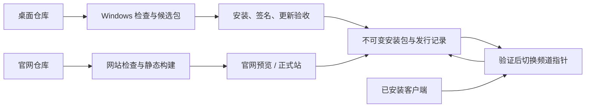

# 官网、CI/CD 与客户端更新实施计划

> 按检查点使用 executing-plans 工作流。2026-09-05 用户已要求开始实施；下文区分当前进展与尚待完成的发行/更新步骤。

**Goal:** 建立独立官网、可追溯的 Windows 候选包流水线和保留任务数据的应用内更新闭环。

**Architecture:** 两个源码仓库分别管理桌面与官网，公开安装包和更新清单放在独立下载存储。官网与客户端读取同一份已发布版本记录；网站部署与桌面发布各自运行，桌面更新仍在当前 Tauri 项目实现。

**Tech Stack:** GitHub / GitHub Actions；现有 Tauri 2、Node 24.19.0、官方 OpenCode；官网已采用 Astro + TypeScript 静态生成。用户已确认 Cloudflare 面向中国大陆与海外、官网域名 `rivloom.com`，暂不增加国内专用 CDN；R2 下载存储与签名方式仍待落实。

**状态：** 2026-09-05 官网已在 [rivloom.com](https://rivloom.com) 部署，SSL 活动；本轮源码 `9a7bd94` 已推送，[官网 GitHub CI 33955696338](https://github.com/rivloom/rivloom-website/actions/runs/33955696338) 与 Cloudflare Pages 部署均通过。正式域及桌面、移动端页面检查已通过。官网按用户授权保留 Cloudflare RUM 统计，已核实设置为“启用，排除欧盟的访问者数据”；CSP、隐私说明与生产索引指令已完成本轮验证，统计面板收到一个自然浏览样本。允许抓取与收录不代表搜索引擎已经实际收录。候选验证记录已在 `d0ffd4c` 提交，基于源码 `86463bf` 的 CI Preview 候选包已完成本地验证；桌面推送和云端 CI 已获本轮用户授权，云端结果按实际推送提交核对。安装包尚未公开发行，应用内更新尚未完成。承接 [RELEASING](../RELEASING.md)、[ADR-0006](../adr/0006-website-distribution-and-safe-updates.md)，不重复定义其安全升级与兼容标准。

## 1. 仓库与目录建议

| 内容               | 建议归属                                                           | 职责                                                                      |
| ------------------ | ------------------------------------------------------------------ | ------------------------------------------------------------------------- |
| 桌面源码           | 现有 `rivloom/rivloom-desktop`；本机 `C:\project\rivloom-opencode` | Tauri、桌面会话 UI、本地服务、Node 协作、updater、安装包与发布流水线      |
| 官网源码           | 已建 `rivloom/rivloom-website`；本机 `C:\project\rivloom-website`  | 产品介绍、下载页、公开用户文档、更新日志、隐私/安全与支持入口、网站 CI/CD |
| 安装包与更新元数据 | 独立对象存储/CDN，R2 为候选                                        | 不可变版本目录、签名、哈希、发布记录和频道指针；不把大文件提交进源码 Git  |

官网与桌面技术上可以使用 monorepo，但此项目建议独立：网站改文案或样式不应触发 Windows 构建；公开网页与桌面源码权限独立；网站部署凭据不接触桌面签名密钥。代价是公共版本信息必须有单一来源，不能靠两个仓库手改版本号。

当前 `src/` 是桌面 WebView 的 UI，`dist/` 是其构建结果；不能直接把它们当官网发布。拟建网站应放在并列目录，不在当前 `.git` 下再嵌套一个仓库。是否公开两个源码仓库分别决定，官网可公开访问不要求官网源码公开。

若采用 R2，不需要再建第三个 Git 仓库。只有决定用 GitHub Releases 公开分发时，才考虑一个只保存发行元数据与 release assets 的公开分发仓库；私有源码仓库令牌不进入用户客户端。

## 2. 发布结构

官网建议先做静态站；Astro 默认预渲染页面，适合介绍和文档，不必为了下载入口增加账户或运行时数据库。[Astro 官方渲染说明](https://docs.astro.build/en/guides/on-demand-rendering/)

安装包必须与页面资源分开存储。当前 docs1 包为 71,096,634 字节；Cloudflare Pages 单个静态资源上限为 25 MiB，不能将该安装包直接塞进网站构建目录。R2 若用于正式下载，应接自有域名，`r2.dev` 只作开发用途。[Pages 限制](https://developers.cloudflare.com/pages/platform/limits/)、[R2 公共访问](https://developers.cloudflare.com/r2/buckets/public-buckets/)

用户已确认官网域名 `rivloom.com`，现已完成 Cloudflare Pages 部署、域名绑定、DNS、HTTPS 与跳转验证，SSL 状态为活动。下载/更新子域名尚待设置。首版同时面向中国大陆与海外，按用户决定先统一采用 Cloudflare；当前网络的访问验证不代表全球传播或各地区访问、下载性能已全面验证。

## 3. 阶段 A：确定第一轮公开范围与发布约定

**产出：** 仓库职责、域名/账户清单、公开范围、版本与签名决策。更新本计划、ADR-0006 和 RELEASING；不先生成长期签名密钥再讨论保管方式。

1. 确认第一批用户地区、中文/英文范围、域名与托管账户控制权，以及是否先开放受控内测下载。
2. 官网仓库建议初建为私有，网站内容公开；桌面仓库可见性保持现状，另行决定开源范围。
3. 首期只展示已验证的 Windows x64。M3.5 用户/双物理机验收和纯 mDNS 已知问题进入目标版本发布记录，不改写成全部通过。
4. 核定 GitHub 套餐支持的分支与发布环境保护、签名方式及预算。Windows 发布者签名与 Tauri 更新签名分开保管；不以 SHA256 代替签名。
5. 约定正式 identifier、唯一应用版本和 stable/beta 边界。当前独立 UI Preview 不直接接入正式 stable/beta 更新源；下一轮新公开版本不继续用多个不同字节的 0.1.3 文件代表同一发行版本。

**完成条件：** 公开对象、维护入口、权限和版本规则可执行，尚未覆盖的验收项逐条可见。官网介绍页可以先上线；开放正式下载和自动更新频道分别按其验收结果推进。

GitHub 私有仓库的 environments 和 required reviewers 可用性受套餐限制，实施前按实际账户确认，不能在计划中假定一定可用；不支持时保留受控的独立发布步骤与最小凭据权限。[GitHub environments](https://docs.github.com/en/actions/how-tos/deploy/configure-and-manage-deployments/manage-environments)

## 4. 阶段 B：桌面 CI 与可复现候选包

**当前进展：** 四份 Windows workflow、明确测试分层、版本/许可/运行时门禁和候选记录已实现；基于源码 `86463bf` 的 CI Preview 已完成本地运行时前后门禁、原生构建、候选记录与独立 NSIS 解包核对。候选验证记录已在 `d0ffd4c` 提交，桌面推送与云端 CI 已获本轮用户授权，此前本地验证不代表新增云端结果。该候选包未安装、签名或公开发行，纯 mDNS 已知失败仍保留。证据见 [CI](../CI.md)、[CI-RUNTIME](../CI-RUNTIME.md) 和 [VERIFICATION](../VERIFICATION.md)。

**实施范围与验收清单：** `package.json`、测试入口、`scripts/desktop-prepare.ts`、许可检查、`scripts/desktop-install-smoke.ps1`，以及 `.github/workflows/ci.yml`、`windows-services.yml`、`lan-regression.yml`、`windows-candidate.yml`。下列条目同时包含已实现要求和后续安装/云端验收，不表示均已完成。

1. PR 基础 CI 使用明确 Windows x64 runner，固定 Node/Rust 工具链和锁文件；`npm ci` 后执行 `npm run build`（已含 typecheck），核对 package/Cargo/Tauri 三处版本。记录构建环境，不声称云 runner 与个人电脑字节级天然可复现。
2. 将测试分成逻辑/协议测试、官方引擎加确定性本地模型的服务测试，以及 LAN/真实双机/原生验收。保留全量入口与覆盖清单，不能因为分层而漏测。
3. `test:model-settings`、`test:permission-policy`、`test:node-p0`、`test:node-queue-crash` 在独立目录运行；真实付费模型与原生交互另设受控验收。报告只上传必要的脱敏结果，不上传整个 `.data`。
4. 已有纯 mDNS 失败独立显示并追踪，UDP 回退与物理正常路径分别记录。不得用 `continue-on-error`、删断言或模糊过滤换取“全绿”；LAN 环境不具备条件时标为未覆盖，不能冒称通过。发行时写清缺陷影响与处理结论。
5. 把许可生成与验证分开：核对锁定依赖、许可原文、Rust 清单、随包运行时和 README/SECURITY 哈希。Rust 许可清单已纳入必需门禁；缓存命中也验证 Node/OpenCode 二进制哈希。
6. 参数化安装烟雾脚本的目标包、旧基线包、产品身份和隔离数据根；清除其对本机旧 0.1.0 包的隐含依赖。用干净测试环境验证，不能在个人正式数据目录跑安装 CI。
7. tag 或手动入口生成候选包、包内清单和发行记录，仅提供待验证产物，不立即修改用户更新频道。

**完成条件：** 干净检出可构建，失败结果透明；候选包能关联唯一 commit、依赖、工具链、哈希和实际验收报告；PR 不获得签名或公开存储写凭据。Actions 固定经核对的完整 commit SHA。[GitHub Actions 安全建议](https://docs.github.com/en/actions/reference/security/secure-use)、[Tauri GitHub 构建指南](https://v2.tauri.app/distribute/pipelines/github/)

## 5. 阶段 C：官网设计、独立仓库与网站 CI/CD

**已建网站目录：** `C:\project\rivloom-website`，Git 远程为 `https://github.com/rivloom/rivloom-website.git`。首版包括 `src/pages/`、`src/content/`、`public/`、`astro.config.mjs`、`.github/workflows/ci.yml` 和开发交接文档；实施和部署实测结果记录在官网仓库 `docs/IMPLEMENTATION.md`。

**当前进展：** Cloudflare Pages 项目 `rivloom-website` 使用 Git 集成，以 `main` 为生产分支，执行 `npm run build:cloudflare`，输出 `dist`。正式域 [rivloom.com](https://rivloom.com) 已部署、SSL 活动；首次 Cloudflare 部署使用源码 `a1b571b`，对应的 [GitHub CI 33951987521](https://github.com/rivloom/rivloom-website/actions/runs/33951987521) 已通过。更早的提交 `edd51ed` 已取得首次绿色 [CI 33950924916](https://github.com/rivloom/rivloom-website/actions/runs/33950924916)。DNS/TLS、8 条页面路由 200、未知路径 404、响应头和 8 项静态资源抽样均通过；浏览器已检查桌面和 390px 移动端的首页、菜单、下载页、FAQ。DNS/TLS 验证限于当前 Windows 网络及三组解析器查询，不扩大为全球或中国大陆性能结论。

本轮源码 `9a7bd94` 已推送且与远端一致，[GitHub CI 33955696338](https://github.com/rivloom/rivloom-website/actions/runs/33955696338) 通过，Cloudflare Pages 部署 `e256a0f4-1c68-4d24-aa02-5c82ab4040b7` 成功。CSP 与官网隐私说明已上线并完成复核；新浏览器检查中的隐私内容正常，本次捕获的警告和错误为空。

用户已明确授权保留 RUM 统计，实际设置已核实为“启用，排除欧盟的访问者数据”。自然浏览后，2026-09-05 08:39:22 UTC 的面板显示访问量 1、页面浏览量 1、页面加载 1105 毫秒，细分数据仍不足。它只证明接收了一个真实样本，不证明流量规模、性能基准或地区排除效果；没有提交模拟遥测。证据见 [RUM 浏览器与面板记录](C:/project/rivloom-opencode/.data/verification/website-rum-browser-20260905.json)。

`site.config.json` 的 `productionIndexing` 已为 `true`，生产站已开放抓取与收录指令。最终 HTTP 复核中，8 条业务页面返回 200、`index, follow`、各自正式域 canonical，且无阻断索引的响应头；未知路径为真实 404 和 `noindex, nofollow`；robots 允许抓取，sitemap 恰好包含 8 条正式页面。这不代表搜索引擎已经实际收录。证据见 [生产索引验证](C:/project/rivloom-opencode/.data/verification/website-indexing-9a7bd94/run-1788597527096/verification.json)。公开下载与客户端升级仍分别属于阶段 D、E。

1. 先完成信息结构与视觉稿：主页、能力/工作方式、Windows 下载、快速开始、版本日志、安全与隐私、反馈入口。只写实际产品能力，素材使用已核对的真实 UI。
2. 页面适配桌面与移动端，完成语义标题、可访问性、SEO 元信息、sitemap、404 和链接检查；具体收集哪些访问数据在隐私说明中对应，首期不默认增加账号/付费后台。
3. 创建独立仓库与静态项目，PR 运行构建、链接/内容校验和关键页面检查，提供预览；主分支检查通过后部署生产站。
4. 托管可选择 Cloudflare Git 集成或由 Actions 驱动部署，第一轮只选一条主部署路径，避免两边重复发布。自动部署规则以分支保护和构建结果为前置。[Cloudflare Git 集成](https://developers.cloudflare.com/pages/configuration/git-integration/)
5. 下载页从阶段 D 的发行记录生成版本、链接、大小、哈希、签名状态和说明。采用构建时读取时，桌面发布后触发官网刷新；刷新失败继续显示明确的旧已发布版本并告警，不伪造新版信息。
6. 绑定域名、HTTPS、必要重定向并从目标地区验证页面和完整安装包下载。首次上线可只开放介绍/内测入口，后续公开下载范围按实际验收扩大。

**完成条件：** 改网站内容可以独立上线，不触发桌面重打包；网页不依赖用户本机服务；所有下载信息都能追溯到公开发行记录。

## 6. 阶段 D：下载存储与桌面发布 CD

**拟改当前仓库：** 新增发行清单生成/校验脚本、上传/频道提升脚本和 `.github/workflows/publish-release.yml`；对象存储与域名只在实施阶段按已确认账户配置。

1. 建立不可变版本目录及 stable/beta 频道指针。候选区与面向用户的公开区区分，未验收包不由正式下载页引用。
2. 从一次受控构建取得最终产物：完成会改变字节的签名步骤后，计算哈希、生成 updater 签名和发行记录；按实际 Tauri 输出核对 NSIS 内部 EXE 与外部签名，不把封装前文件的哈希当最终安装器哈希。
3. 发行记录包含版本、应用身份、平台、commit、安装包 URL/大小/SHA256、签名状态、发布说明与兼容范围。Tauri 清单按官方格式生成，官网下载记录与其来自同一版本产物，不直接把自定义 JSON 当 updater 协议。
4. 上传不可变产物后，从公开 URL 下载校验；全部验证成功才切换频道指针。防止同版本不同字节、并发发布和上传中断造成部分发布；发布失败保留原指针。
5. 用最小权限隔离网站部署、对象上传、频道提升、Windows 签名和 updater 私钥；发布依据锁定 commit/候选记录，不能在签名步骤重新拉取一个变化的分支。
6. 故障版本先停止继续推荐，再发布更高版本修复；不把网页回滚或频道回切当成用户数据可以降级。完整演练失败上传和暂停推荐。

**完成条件：** 官网下载与更新源一致、产物可追溯、重复或失败发布不能破坏现有频道。公开 stable 的签名及发行验收按 RELEASING 执行；该计划不自动购买证书或公开旧预览。

## 7. 阶段 E：客户端安全更新与迁移

**拟改当前仓库：** `src-tauri/Cargo.toml`、`src-tauri/tauri.conf.json`、`src-tauri/src/main.rs`、`src-tauri/permissions/`、`src/desktop.ts`、更新 UI；本地维护/退出/恢复与迁移模块。以锁定版本核对插件接口后再写实现。

1. 接入官方 Tauri updater，配置 HTTPS 端点、内置公钥与更新产物；提供检查更新、查看说明、下载、稍后安装入口。官方下载插件支持静态 JSON 与签名验证，不需要先建自研更新后台。[Tauri updater](https://v2.tauri.app/plugin/updater/)
2. 下载与安装分开。安装前进入临时维护状态，阻止新的准入/调度，处理已经确认的工作，可靠保存队列、控制和执行状态，并通过原生命周期退出自有服务与引擎。
3. 在 Rust 侧保留精确窗口/origin 与命令权限边界，不向普通网页暴露任意安装能力。运行、审批、待验收和未知执行不能被静默完成；固定 Master 更新期间的调度影响明确显示。
4. 完善持久数据格式检查与有序迁移，保留 Node 身份、信任、Brain/Task/Execution/session、项目配置及凭据。迁移失败不接单；备份只针对本产品数据，不回滚用户项目文件。
5. 完成两段验收：现有正式 0.1.3 手动覆盖安装到首个带 updater 的正式版本 V1，再由 V1 在应用内更新到 V2。当前独立 Preview 不能代替正式 identifier/data root 的这一验收。
6. 核对错签名/损坏包、断网、空间不足、安装失败、迁移中断，以及新旧 Node 交叉协作；确认原任务不重复生成 session，未知执行不被重派。检查更新失败不能阻塞本机正常工作。

**完成条件：** 两段真实升级均有证据，安全退出、数据恢复和混合版本边界明确后，才能宣称“应用内更新已完成”。V1/V2 的实际版本号在实施时确定。

## 8. 推荐推进顺序与停点

先完成 A 的边界约定，B 桌面 CI 与 C 官网视觉/静态页可以并行；C 的正式下载入口依赖 D 的发行记录。E 的维护/迁移工作可与 D 并行，正式自动更新频道须等 D+E 完成。

第一轮可评审交付：两个仓库职责明确、官网视觉与可浏览预览、桌面基础 CI 和可追溯候选包。第二轮交付下载/CD，第三轮完成真实应用内更新。用户已由规划转为实施；本地源码、云端 CI、公开网站、安装包发行和客户端更新分别记录，不以任一环节完成替代其他验收。

域名、托管方向和首批地区已确认；官网 GitHub 仓库为私有，Cloudflare 仓库连接、部署及正式域名验证已完成。官网按用户授权保留 RUM 统计，已核实设置为“启用，排除欧盟的访问者数据”；本轮 CSP、隐私说明、单个统计接收样本及生产抓取/收录指令均已复核。桌面推送及云端 CI 已获本轮用户授权，云端结果按实际推送提交核对。后续仍需落实下载存储、正式发行签名与密钥保管方式，并核对 GitHub 分支/环境保护能力。现有本机预览和正式客户端数据均保留。
