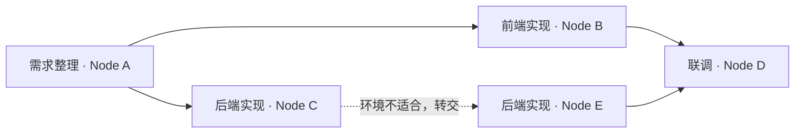

# 协作任务图、资源发现与动态转交：开发前确认稿

日期：2026-09-09。状态：用户确认的四项修订及 `@`/`@@` 交互已实现，功能、生产 UI 和隔离官方引擎检查通过；`785a8157` 本地安装包已完成构建、解包及交付核验，见[实施计划](2026-09-09-collaborative-task-flow-implementation.md)。技术依据见 [ADR-0010](../adr/0010-proposed-task-graph-and-node-handoff.md)。旧 `a152322c` 本地安装包不包含本方案。本文保留已确认的产品范围；实际限制包括只转交已保存业务检查点、不确定执行不重跑、暂停后已入队执行继续，以及旧节点不参加新工作流。

## 目标

用户仍从一个会话发送任务。系统了解配对机器的资料、软件和硬件，先寻找资源，再自动安排多步骤、并行与依赖。执行中发现资料或能力不适合时可以委托其他 Node 或转交执行。用户在原会话通过会自动更新的任务卡和连线了解整个过程，并在同处获得结果。

## 1. 配对机器主动登记资源与能力

- 流程为 **Node 配对 → 用户选择工作目录 → Node 主动登记到 Brain**。目录选择完成且认证通道可用后，登记该目录内可发现的项目、文档、素材等信息，以及基础软件、可用模型和硬件能力；未选择目录时显示待选择，不推测目录或扫描其他位置。
- Brain 汇总资源名称、类型、标签、位置、版本、最近确认时间和可用操作；首轮登记以目录和元数据为主，正文与素材按需获取。
- 首次连接分批同步；文件或配置变化合并发送增量；周期校对补遗漏；重连按版本补齐。大型目录扫描和软件探测放在后台，限制工作量，保持界面与现有任务响应。
- CPU/GPU 使用率、空闲资源、暂停与队列等动态状态继续独立更新。离线 Node 的资料位置可作为最后已知信息保留，但不会被当成当前可执行。
- 范围限已配置并允许发现的工作目录及工作相关软件，不扩展为全盘全文同步；已有凭据及参与方数据边界保持。

## 2. 轻量协作查询

- 支持“谁有文档 abc”“哪个 Node 有某素材”“谁具备某工具”等请求。
- 先查 Brain 汇总目录；信息不足或过期时，Brain 向可能命中的 Node 询问；无法缩小范围时，在该请求的协作范围内并行询问所有可达 Node。
- 结果带来源和确认时间；离线、超时、没有找到、存在多个版本分别表达。查询有期限、去重和结果上限。
- 普通查找不创建正式任务、执行会话或队列项，不占执行并发，不触发 10 个任务的队列提醒。常规查找用本机索引完成，无需每台 Node 都运行一次 Agent。实际大量分析或生成进入正常任务流程。
- 用户在原会话看到可展开的“正在查找／在 B 找到”记录，不因询问多台机器增加一批历史任务卡。

## 3. 用户发任务，系统自动生成任务图

- 所有执行请求先分析目标、输入、可能的步骤及资源需求，再判断是否需要有实际意义的拆解。用户无需事先声明“复杂任务”，也无需选择机器；不能用有没有 `@`、文字长短或预计 Node 数量判断复杂度。
- 分析后若只有一个独立执行步骤，保持普通会话；若拆出多个有意义的步骤、并行分支或前后依赖，在原会话自动展示可折叠任务图，即使最终只用一台机器也可展示。原先简单的任务执行中出现新分支或转交时，任务图再自然展开。
- 用户无需手动画图。Brain 结合必要的轻量资源查询，生成步骤及输入/输出关系，自动选择适合的 Node；显式顺序约束优先于自动优化。无 `@` 表示系统按需求安排，并非强制本机执行；轻量查询本身仍不升级为复杂执行任务。
- 用户示例：“根据这个脚本，将合适的素材取出来并完成剪辑。”先理解脚本并确定素材要求，再定位素材；可并行的筛选、准备等工作形成分支，剪辑依赖必要素材就绪，最后输出视频。实际拆分取决于输入和可用资源，不硬套固定模板或假设用户已理清机器分工。
- 卡片表示一个步骤或其具体执行段，显示步骤名称、执行 Node、真实状态、简要进展和结果入口。一个 Node 可承担多个步骤。
- 依赖连线表示前置步骤和所需产物；并行分支同时推进，汇合步骤等待所有必要前置成功且产物就绪。
- 点击卡片查看执行过程、输入输出和归属；未开始的步骤可调整要求、执行 Node 和依赖。编辑时检测循环依赖；已开始的执行保留原版本，重新执行产生新的执行记录，不静默重跑已完成的下游。
- 实际进展与后续拆分可追加卡片，自动布局维持阅读位置，动效仅突出当前执行路径，支持减少动画。

## 4. 找到资源后选择协作方式

| 情况 | 行为 | 用户看到的变化 |
| --- | --- | --- |
| 所需资料在 B，适合取回，A 能继续 | 获取所需资料或片段，由 A 继续 | 原会话中的获取记录 |
| 资料或工具适合在 B 就地使用 | 委托 B 完成一个明确子步骤 | 新子步骤卡与依赖/结果关系 |
| 剩余工作整体需要另一台机器 | 原步骤从 A 转交 B | 保留 A 执行卡，追加 B 执行卡与转交线 |

判断不限硬件，还包括文档/素材位置、软件、模型、访问条件、传输成本和当前负载。软件存在与当前能够处理分开验证。繁忙可以排队，不等于机器不适合。

## 5. 动态转交与两种连线

- Agent 可因缺少资料、工具、环境或计算资源提出结构化转交请求，原协调方负责选择、校验及持久交接。
- 转交前由目标机器自动确认当前可处理。已开始的原执行须确认停稳，再交接要求、输入和可复用中间结果，启用目标执行。
- 依赖连线连接不同步骤；转交连线连接同一步骤在两台机器的执行记录，明确显示原因，如“素材位于 B”“缺少工具”“显存不足”。
- 用户始终保留原任务和会话，转交后在原处查看进度、停止工作和接收结果；每个执行段保留实际发生的记录。
- 网络超时、旧消息和重试不得制造重复任务或执行；无法确认原执行停止时显示等待确认。已完成的准备工作尽量复用，任意进程或 GPU 内存的无损迁移不作为通用能力承诺。
- 转交次数有界，避免 Node 之间反复转交；找不到目标时在原任务解释缺少条件并等待可处理的动作。

## 6. 已确认规则与 `@`/`@@` 交互

用户已明确下列语义，尚未改变现有产品行为：

1. 无 `@`：先分析任务，自动选择执行位置和分工。
2. 单 `@Node`：首选该机器，按需要可协作或转交。
3. 连续双 `@@Node`：仅锁定该机器执行。任务仍可拆分和展示图，但执行步骤遵守该锁定，不能通过创建远端子任务绕开；旧固定目标任务保持原有语义。
4. 自动生成计划后，条件满足即执行，不增加逐步骤人工验收。用户仍可调整未开始步骤、暂停或停止；危险工具审批和目标队列达到 10 时的提交方确认继续有效。转交到另一目标时不能复用之前对不同 Node 的队列确认。

本轮对锁定范围的设计解释：锁定的是执行机器；可以查询及获取协作范围内的资料，由锁定机器处理。无法满足执行条件时提示原因，允许用户修改首选/锁定设置或等待，不能自动换机。任务已开始后的目标修改沿停止和新执行记录处理。

### 让用户发现并理解双 `@`

- 输入框下方的机器入口旁保留简短提示：`@ 首选机器 · @@ 锁定机器`；提示可点击，效果等同输入对应前缀。它是常规入口，不依赖说明书或只能出现一次的教学提示。
- 输入 `@` 或点击机器入口，打开同一个选择菜单。菜单顶部显示 `@ 首选` / `@@ 锁定` 两个可切换选项；模式说明分别为“优先在这台机器执行，必要时可转交”和“仅在这台机器执行，无法处理时提示你”。
- 连续输入第二个 `@` 时，菜单切换到锁定；点击模式选项也同步输入前缀。用户不需要掌握快捷写法才能锁定。
- 选择后在发送前始终显示目标标签：`首选 · Node A` 或带锁图标的 `锁定 · Node A`。点击标签可以修改机器或模式；独立取消按钮恢复自动选择。不能只靠颜色或两个难辨认的符号表达路由。
- 输入前缀、标签和发送时保存的结构化规则保持一致；机器使用稳定 ID，草稿保存模式和目标。改名、重名、正文提及另一 Node 或修改已运行会话文字不能静默改派。旧草稿迁移沿原目标语义，保持已有输入法与键盘行为。
- Enter 选择机器，Esc 关闭菜单，方向键切换候选；中文输入法确认优先。触屏可点击模式选项和标签完成全部操作。
- 本轮独立交互样稿覆盖单/双 `@`、可见切换、目标标签、取消、键盘及空结果；736px/360px 明暗外观检查通过。样稿尚未接入真实提交。

失败步骤会阻塞其依赖下游；独立分支可继续。用户停止整个任务时，阻止后续启动并协调停止正在执行的各段；操作结果未知须显示真实等待状态。

## 7. 开发顺序与完整交付范围

采用分阶段实现和验证，顺序为：

1. Node 目录/软件/硬件登记，Brain 汇总，轻量查询与增量同步。
2. 稳定的原任务、步骤和执行历史，卡片与两种连线，单步骤完整跨机转交。
3. 自动拆分、依赖、并行、汇合，按需取资料/委托子步骤及原会话控制。
4. 完善执行中交接、失败/取消/重启恢复、同名资料版本与真实跨机场景。

这是完整功能的实施顺序，不能将“只完成资源发现”标为整项交付完成。视频等专门执行器可先通过明确适配支持业务步骤级继续，工具特定的内部计算检查点另行验证。新增功能先基于现有可认证协作范围；需要跨 Brain 或仅通过中间节点配对的委托必须补齐任务范围授权与路由，不能假定全网互信。

最终至少用以下用户场景验证：

- 配对后 Brain 能查到配置目录内的 abc；新增、移动、删除和断线重连后目录正确更新。
- 查询先命中目录，缺信息时询问各 Node；不创建正式任务，不将离线误报为没有资料。
- 发一条任务即可生成先后/并行/汇合图，条件满足后执行，真实状态回到原会话。
- A 缺资料时能取回或委托 B；A 不适合时能转交 B，并自动追加转交记录与连线。
- 转交/停止/取消/结果回传中断重试不重复执行；大文件和中间结果校验正确。
- 原有会话、来源配色、队列与工具审批、附件、通知定位继续工作；后台发现和图更新不明显影响界面响应。

## 当前停点

用户已回复“可以，先按这个来吧，接下去你要开发了么”，据此进入开发。交互样稿已经独立检查，接下来按实施计划完成真实功能；不重复询问已确认的范围或规则。工程进展以实施计划和后续交接记录为准。
